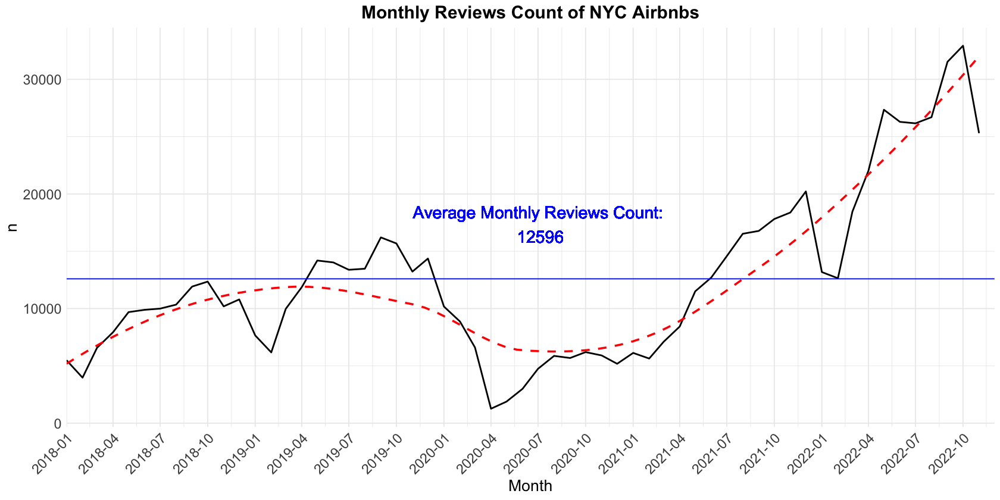
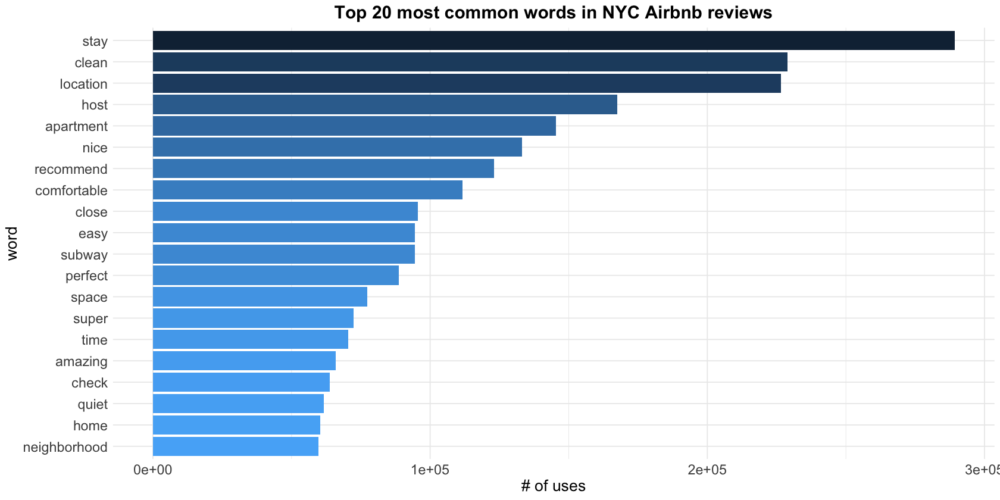
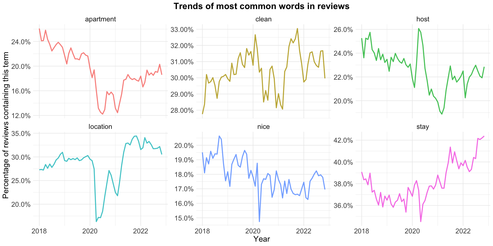
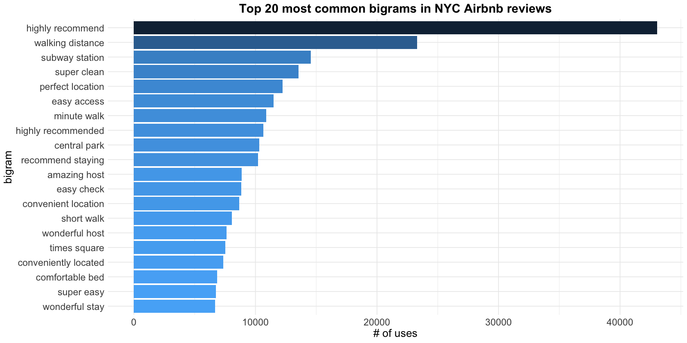
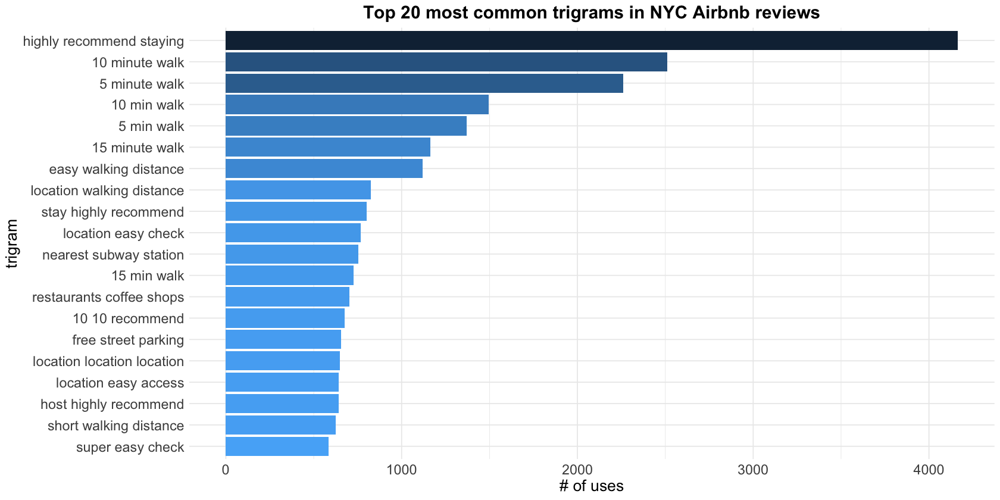
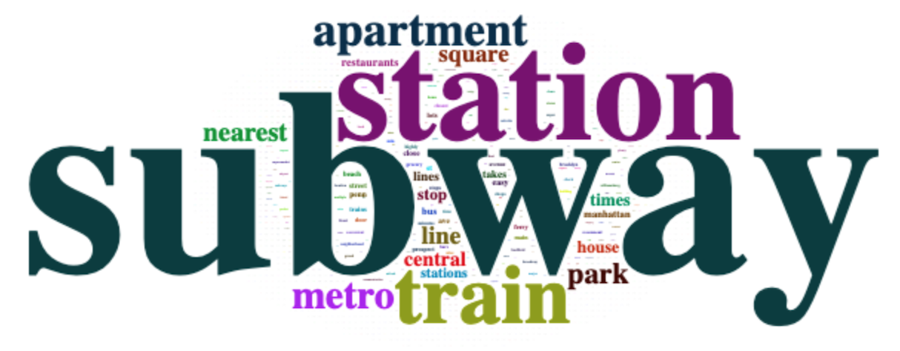
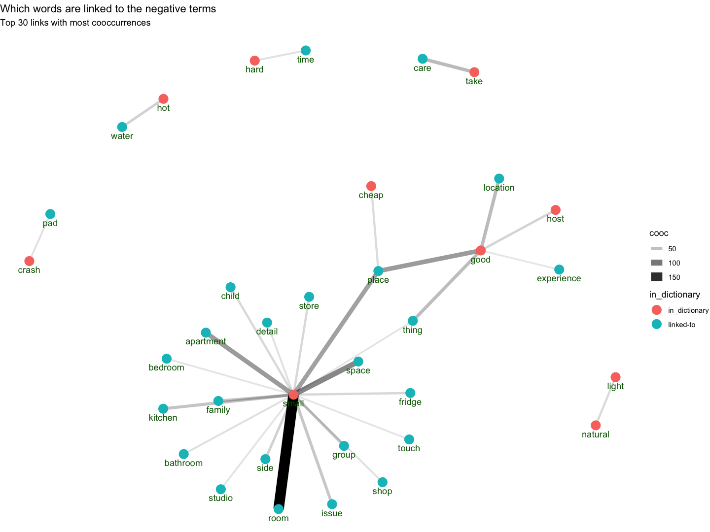
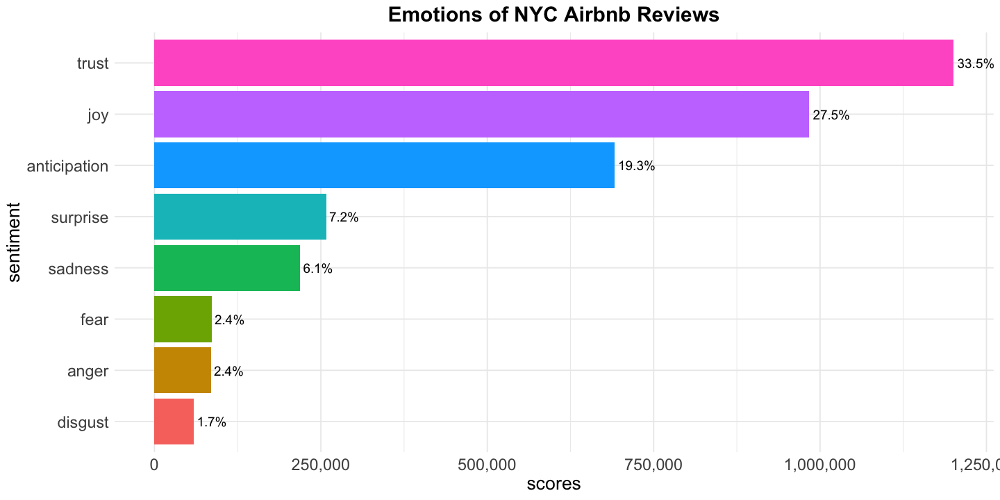
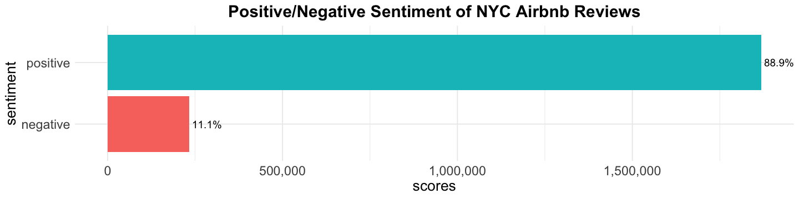
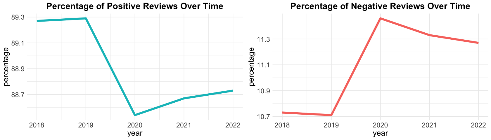

# [Text Mining and Sentiment Analysis of New York City Airbnb Reviews](https://github.com/eeliuqin/Airbnb-Reviews-Text-Mining-and-Sentiment-Analysis/blob/main/airbnb-nyc-sentiment-analysis.ipynb)

## TABLE OF CONTENTS

* [Introduction](#introduction)
* [Objective](#objective)
* [Tools](#tools)
* [Data Source](#data-source)
* [Data Processing](#data-processing)
* [Data Visualization](#data-visualization)
* [Results](#results)
* [Conclusion](#conclusion)

## Introduction

[Airbnb](https://en.wikipedia.org/wiki/Airbnb) is a global online marketplace for arranging or offering lodging and experiences, it has grown to become one of the largest online marketplaces for lodging in the world, while New York City (NYC) is one of the most popular cities on Airbnb [[1](#1)], which means the competition is also brutal. Therefore, it's vital to understand what users like and dislike and make improvements to enhance the overall customer experience.

## Objective

Conducting text mining and sentiment analysis on 2018-2022 NYC Airbnb reviews to find out what guests cared about most and why they left negative reviews.

## Tools

|  | Tools/Packages|
|---|---:|
| Language | R |
| Environment | Jupyter Notebook |
| Data processing | tidyverse, lubridate, cld2 |
| Data visualization | ggplot2, ggraph, gridExtra, tidygraph |
| Text mining | tidytext, quanteda |
| Sentiment analysis | lexicon_afinn, udpipe |

## Data Source

Reviews data `reviews.csv.gz` can be downloaded from [insideairbnb.com](http://insideairbnb.com/get-the-data/), in the section of New York City, New York, United States.

## Data Processing
- Data filtering: filter data by date (2018-01-01 to 2022-11-30 only) and language (English only)
- Data cleaning: remove missing values (close to 0%), html tags (e.g.: \<br\/\>), duplicates, unnecessary columns (id, name of reviewer)
- Data manipulation: modify column names and data types

A dataset of 743K+ reviews was obtained.

## Data Visualization

### Number of reviews over time

  

The number of reviews dropped rapidly during 2020/03-2021-06 because of COVID-19 pandemic [[2](#2)]. In general, the number of reviews increases year by year, but fluctuate seasonally (decreased in winter).

### Most common words and trends

  
  

The popularity of "location", "clean" was rising slowly.

### Most common bigrams and trigrams

  
  

Both bigrams and trigrams were heavily related to **minute walk**.

### Starting and ending points of "minute walk"

  
  

### Words linked to negative reviews

  

### Emotions and trends

  
  
  

## Results

- The **location** of the listing was very important to guests, they cared about the **walking distance** to **subway station**, and most often mentioned **5 minute walk** or **10 minute walk**. Besides, **clean** and **host** were also high frequency words.
- Reviews were more **positive** (88.9%) than negative (11.1%), the strongest emotions of reviews was **Trust** and **Joy**, which accounted for 61% of all emotions.
- Negative reviews were associated with limited space, where **small room** was strongly linked to negative reviews, followed by **small place** and **small apartment**. Besides, hosts also need to take care of issues such as hot water and natural light.

## Conclusion

This study focused on analyzing 743K+ reviews of Airbnb in New York City, 2018-2022. Exploratory data analysis was conducted to find the trend in the number of reviews. Text mining and sentiment analysis was further implemented to find the most popular words, the popularity trend, reasons for negative reviews, and overall sentiment. This study can help lodging companies and hosts better understand user needs and improve customer satisfaction.

## References

<a id="1">[1]</a> The Most Popular Cities for Airbnb in the U.S. - https://www.statista.com/chart/18963/most-popular-us-cities-for-airbnb-homeaway/
 
<a id="2">[2]</a> COVID-19 pandemic in New York City - https://en.wikipedia.org/wiki/COVID-19_pandemic_in_New_York_City
